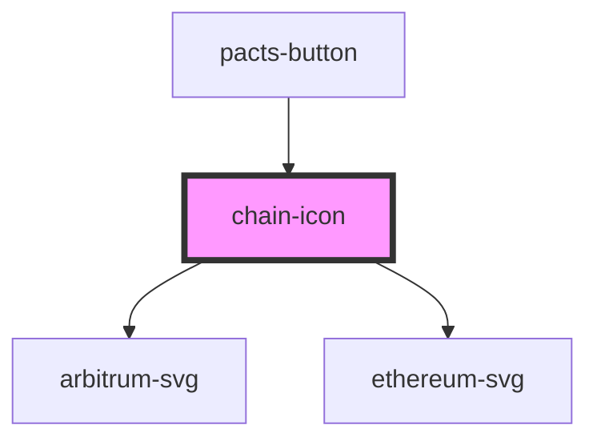

# chain-icon

<!-- Auto Generated Below -->

## Properties

| Property | Attribute | Description                                   | Type     | Default     |
| -------- | --------- | --------------------------------------------- | -------- | ----------- |
| `chain`  | `chain`   | The name of the chain for the order processor | `string` | `undefined` |
| `height` | `height`  |                                               | `string` | `'2rem'`    |
| `width`  | `width`   |                                               | `string` | `'2rem'`    |

## Dependencies

### Used by

 - [pacts-button](../pacts-button)

### Depends on

- [arbitrum-svg](../arbitrum-svg)
- [ethereum-svg](../ethereum-svg)

### Graph

----------------------------------------------

*Built with [StencilJS](https://stenciljs.com/)*
