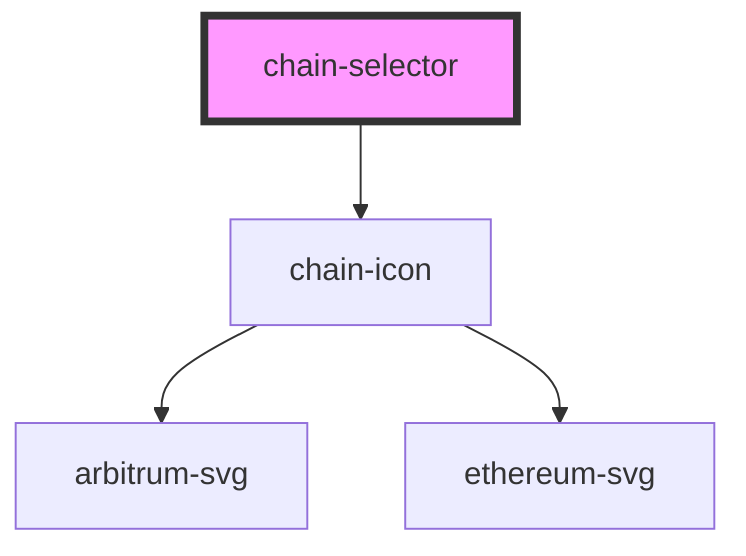

# chain-selector

<!-- Auto Generated Below -->

## Properties

| Property   | Attribute   | Description                 | Type     | Default     |
| ---------- | ----------- | --------------------------- | -------- | ----------- |
| `chain`    | `chain`     | chain name to render        | `string` | `undefined` |
| `iconSize` | `icon-size` | Size of the icon above text | `string` | `'4rem'`    |

## Dependencies

### Depends on

- [chain-icon](../chain-icon)

### Graph

----------------------------------------------

*Built with [StencilJS](https://stenciljs.com/)*
