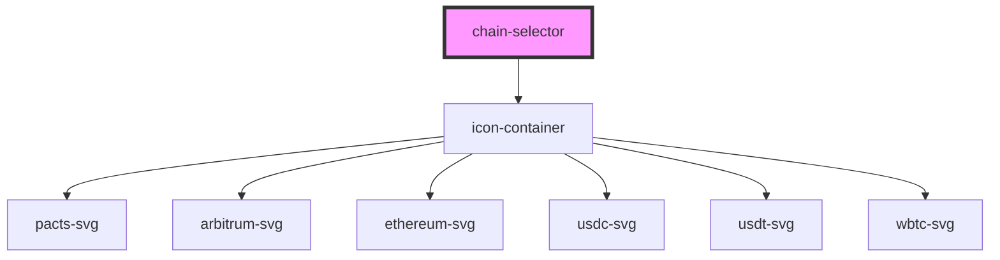

# chain-selector

<!-- Auto Generated Below -->

## Properties

| Property | Attribute | Description           | Type     | Default     |
| -------- | --------- | --------------------- | -------- | ----------- |
| `chains` | `chains`  | Chain names to render | `string` | `undefined` |

## Dependencies

### Depends on

- [icon-container](../icon-container)

### Graph

----------------------------------------------

*Built with [StencilJS](https://stenciljs.com/)*
