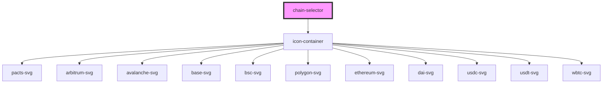

# chain-selector

<!-- Auto Generated Below -->

## Properties

| Property      | Attribute      | Description              | Type                  | Default     |
| ------------- | -------------- | ------------------------ | --------------------- | ----------- |
| `activeChain` | `active-chain` | The current active chain | `string \| undefined` | `undefined` |
| `chains`      | `chains`       | Chain names to render    | `string`              | `undefined` |
| `iconSize`    | `icon-size`    | Size of chain icons      | `string`              | `'4rem'`    |

## Events

| Event           | Description                          | Type                  |
| --------------- | ------------------------------------ | --------------------- |
| `chainSelected` | Event emitted when chain is selected | `CustomEvent<number>` |

## Dependencies

### Depends on

- [icon-container](../icon-container)

### Graph

----------------------------------------------

*Built with [StencilJS](https://stenciljs.com/)*
