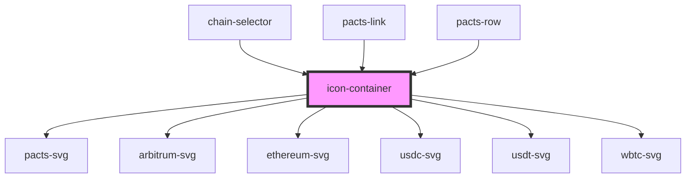

# icon-container

<!-- Auto Generated Below -->

## Properties

| Property | Attribute | Description                     | Type     | Default     |
| -------- | --------- | ------------------------------- | -------- | ----------- |
| `icon`   | `icon`    | The name of the icon to display | `string` | `undefined` |
| `size`   | `size`    | size of the icon                | `string` | `'3rem'`    |

## Dependencies

### Used by

 - [chain-selector](../chain-selector)
 - [pacts-link](../pacts-link)
 - [pacts-row](../pacts-row)

### Depends on

- [pacts-svg](../pacts-svg)
- [arbitrum-svg](../arbitrum-svg)
- [ethereum-svg](../ethereum-svg)
- [usdc-svg](../usdc-svg)
- [usdt-svg](../usdt-svg)
- [wbtc-svg](../wbtc-svg)

### Graph

----------------------------------------------

*Built with [StencilJS](https://stenciljs.com/)*
