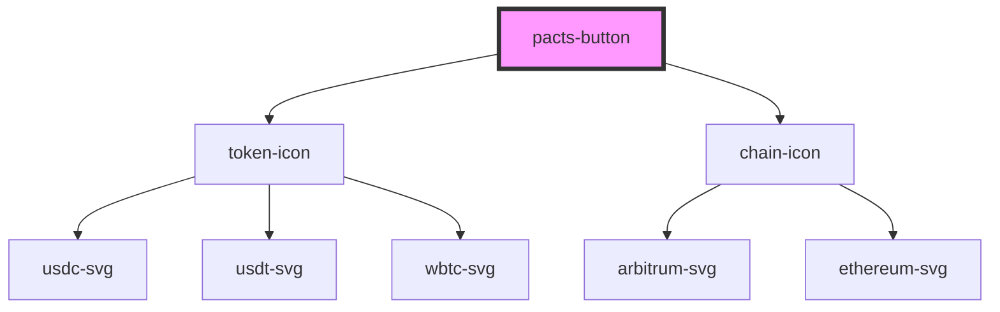

# pacts-button

<!-- Auto Generated Below -->

## Properties

| Property        | Attribute         | Description                                       | Type                  | Default     |
| --------------- | ----------------- | ------------------------------------------------- | --------------------- | ----------- |
| `address`       | `address`         | The address of the order processor                | ``0x${string}``       | `undefined` |
| `chain`         | `chain`           | The name of the chain for the order processor     | `string`              | `undefined` |
| `chainIconSize` | `chain-icon-size` | Size for the chain icon                           | `string`              | `'2rem'`    |
| `metadata`      | `metadata`        | Public metadata to associate with the order       | `string`              | `'{}'`      |
| `orderId`       | `order-id`        | The order id to use                               | `string \| undefined` | `undefined` |
| `price`         | --                | Price of the order in token units                 | `bigint`              | `undefined` |
| `shipping`      | --                | Shipping cost of the order in token units         | `bigint`              | `undefined` |
| `token`         | `token`           | The token of the currency for the order processor | `string`              | `undefined` |

## Events

| Event                 | Description                                  | Type                                                                                                                                                                                                                                                                                                                                                                                                                                                                                                                                    |
| --------------------- | -------------------------------------------- | --------------------------------------------------------------------------------------------------------------------------------------------------------------------------------------------------------------------------------------------------------------------------------------------------------------------------------------------------------------------------------------------------------------------------------------------------------------------------------------------------------------------------------------- |
| `submissionErrored`   | Event emitted when order submission errors   | `CustomEvent<Error>`                                                                                                                                                                                                                                                                                                                                                                                                                                                                                                                    |
| `submissionStarted`   | Event emitted when order submission starts   | `CustomEvent<any>`                                                                                                                                                                                                                                                                                                                                                                                                                                                                                                                      |
| `submissionSucceeded` | Event emitted when order submission succeeds | `CustomEvent<{ blobGasPrice?: bigint \| undefined; blobGasUsed?: bigint \| undefined; blockHash: `0x${string}`; blockNumber: bigint; contractAddress: `0x${string}` \| null \| undefined; cumulativeGasUsed: bigint; effectiveGasPrice: bigint; from: `0x${string}`; gasUsed: bigint; logs: Log<bigint, number, false>[]; logsBloom: `0x${string}`; root?: `0x${string}` \| undefined; status: "success" \| "reverted"; to: `0x${string}` \| null; transactionHash: `0x${string}`; transactionIndex: number; type: TransactionType; }>` |

## Methods

### `submitOrder() => Promise<void>`

Called to submit orders when button is clicked

#### Returns

Type: `Promise<void>`

## Dependencies

### Depends on

- [token-icon](../token-icon)
- [chain-icon](../chain-icon)

### Graph

----------------------------------------------

*Built with [StencilJS](https://stenciljs.com/)*
