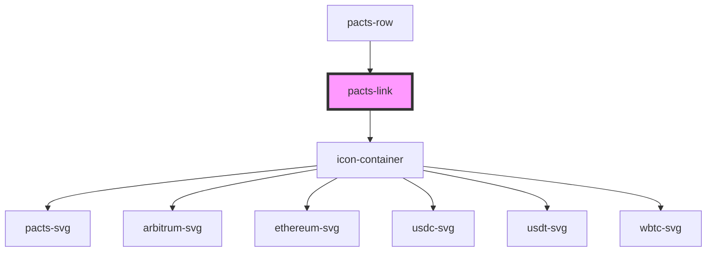

# pacts-icon

<!-- Auto Generated Below -->

## Properties

| Property   | Attribute   | Description             | Type     | Default    |
| ---------- | ----------- | ----------------------- | -------- | ---------- |
| `fontSize` | `font-size` | Size of the pacts font  | `string` | `'1rem'`   |
| `iconSize` | `icon-size` | Size for the pacts icon | `string` | `'1.5rem'` |

## Dependencies

### Used by

 - [pacts-row](../pacts-row)

### Depends on

- [icon-container](../icon-container)

### Graph

----------------------------------------------

*Built with [StencilJS](https://stenciljs.com/)*
