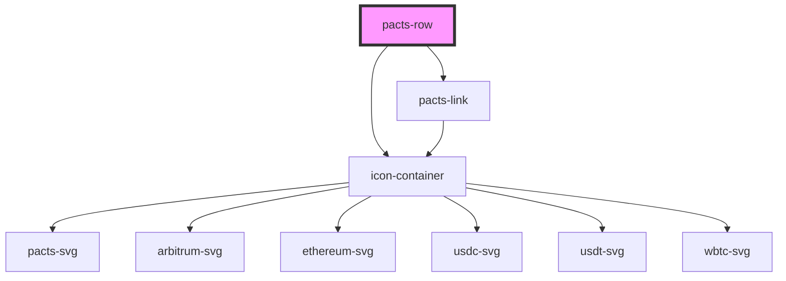

# pacts-row

<!-- Auto Generated Below -->

## Properties

| Property   | Attribute   | Description             | Type     | Default     |
| ---------- | ----------- | ----------------------- | -------- | ----------- |
| `iconSize` | `icon-size` | Size for the pacts icon | `string` | `'2.5rem'`  |
| `token`    | `token`     | Token name to display   | `string` | `undefined` |

## Dependencies

### Depends on

- [icon-container](../icon-container)
- [pacts-link](../pacts-link)

### Graph

----------------------------------------------

*Built with [StencilJS](https://stenciljs.com/)*
