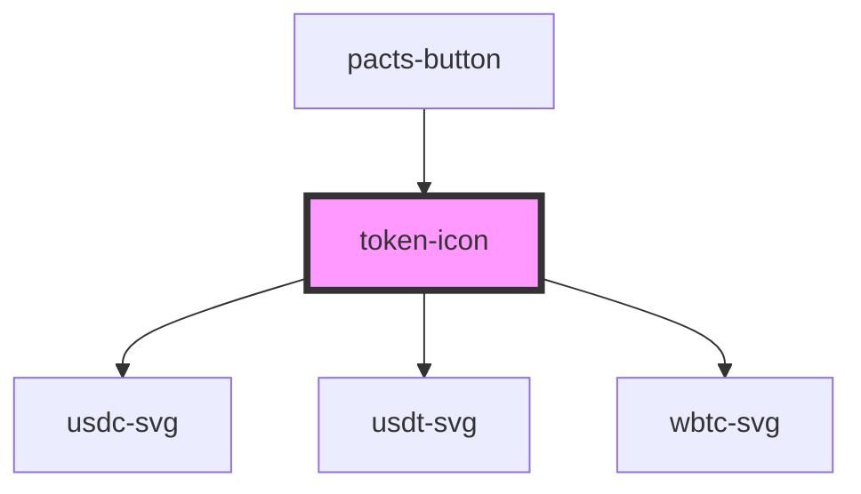

# token-icon

<!-- Auto Generated Below -->

## Properties

| Property | Attribute | Description                                       | Type     | Default     |
| -------- | --------- | ------------------------------------------------- | -------- | ----------- |
| `token`  | `token`   | The name of the token used in the order processor | `string` | `undefined` |

## Dependencies

### Used by

 - [pacts-button](../pacts-button)

### Depends on

- [usdc-svg](../usdc-svg)
- [usdt-svg](../usdt-svg)
- [wbtc-svg](../wbtc-svg)

### Graph

----------------------------------------------

*Built with [StencilJS](https://stenciljs.com/)*
